```{r setup, include=FALSE}
knitr::opts_chunk$set(echo = TRUE)
```

# Introduction to Ordination

### Outline

1.  Introduction
2.  Definition of Ordination
3.  Review of Matrices and Matrix Algebra
4.  Dissimilarity Measures/Distance Coefficients
5.  Unconstrained Ordination
6.  Constrained Ordination

***

## Introduction

So far in this course we have learned several powerful techniques for analyzing data (LM's, GLM's, GLMM's, GAM's, etc.). All of these methods focus on modeling one response variable as a function of one or more predictor variables. For example, say we want to know how a fish species of interest (Cottus gobio) is impacted by a handful of environmental variables (pH, average stream flow, and dissolved oxygen concentration).

{Width=75%}

We can do this easily with a gamma-distributed GLM.

```{r results = 'hide', message = F, warning = F}
# Load libraries ----
library(codep)
library(vegan)

# Load Doubs fish Data ----
data(Doubs)
species <- as.data.frame(Doubs.fish[-8,])
vars <- as.data.frame(cbind(Doubs.env[-8,],Doubs.geo[-8,]))

```

```{r}
# Run a Gamma-Distributed GLM
CHA.alt <- species$CHA + 1
COGO_mod <- glm(CHA.alt ~ pH + flo + oxy, data = vars, family = Gamma(link = "log"))
summary(COGO_mod)
```

It looks like this fish does better when dissolved oxygen concentrations are higher. Cool!

But, what if we were interested in not just one fish, but an entire community of fishies?

{Width=75%}

This is where multivariate analysis shines! Multivariate analysis is any analysis that allows us to address the simultaneous observation or analysis of more than one response variable. In multivariate analysis, we can ask questions like:

-   How does the bacterial composition on maple leaves change along an elevational gradient?
-   What is the compositional dissimilarity of bat communities?
-   How closely-related are local spider communities in relation to their composition?
-   What environmental variables influence the abundance of fishes in the Shark Tale community?

------------------------------------------------------------------------

## Definition of Ordination

So now that we know what kind of questions multivariate analysis can answer, what is Ordination? In very general terms:

**Ordination is a collective term for multivariate techniques which summarize a multidimensional dataset in such a way that when it is projected onto a low dimensional space, any intrinsic pattern the data may possess becomes apparent upon visual inspection** (Pielou, 1984).

Ordination can also be thought of as the ordering of objects characterized by multiple attributes, hence why it is a type of multivariate analysis. In ecological terms, ordination is often used to summarize complicated community data into a low-dimensional ordination space which places similar species and samples close together while less-similar species and samples are further apart. The dimensions of this low-dimension ordination space often represent environmental or variable gradients, the relative importance of which can be quantified to understand how they structure complicated community data.

Additionally, the results from most ordination techniques can readily be graphed into intuitive interpretations of species-environment relationships.

We can make informative and great looking figures like this:

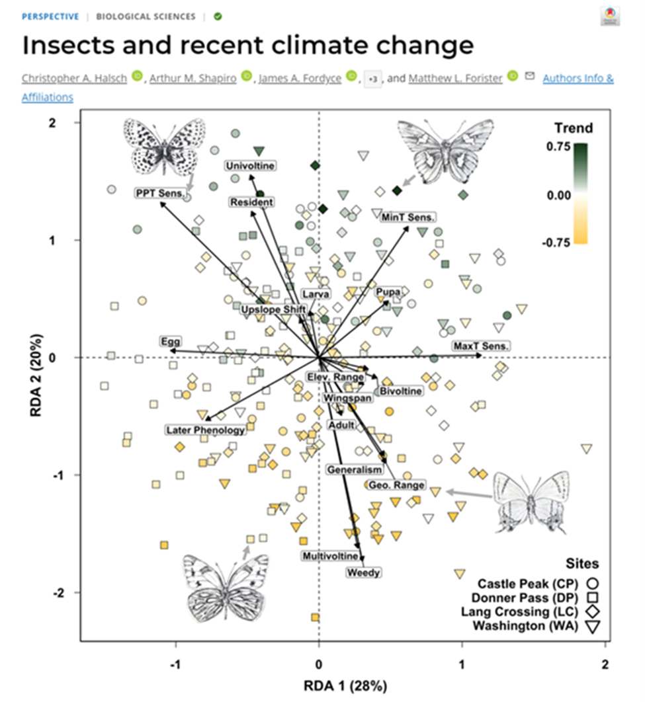{width="50%"}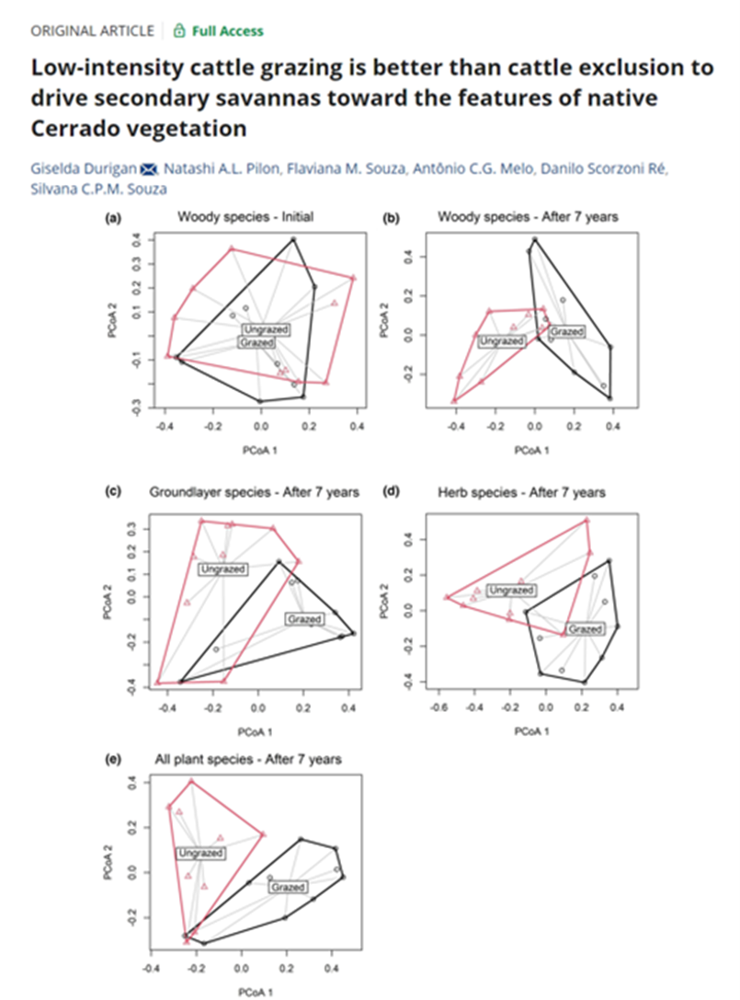{width="50%"}

In order to understand the techniques behind ordination, we first need to have a basic understanding of matrices and matrix algebra

------------------------------------------------------------------------

## Review of Matrices and Matrix Algebra

Most ecological data can take the form of a matrix, where x is the sampling unit (e.g., site, plot), and y is the ecological descriptor (e.g., species presence-absence, topographical variables, chemical variables).

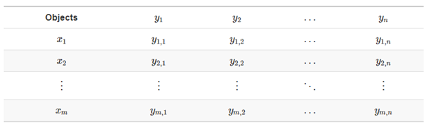

The same ecological data table can be represented in matrix notation like this:

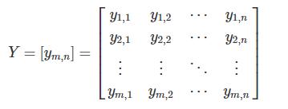

### Association Matrices

Using the data from our matrix Y:


one can examine the relationship between the first two objects (rows):

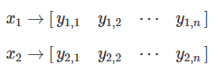

and obtain  a~1,2~. 

We can populate the association matrix A~n,n~, with the relationships between all objects from Y.

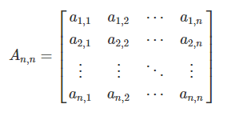


This is the basis of most ordination methods (Q-mode, where the associations between objects, or sites/plots, are analyzed).

We can also analyze the associations between ecological descriptors (columns) (R-mode).

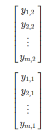

We can populate the association matrix A~m,m~ with the relationships between all descriptors from Y:

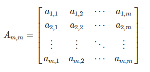

***

## Dissimmilarity Measures

Now that we understand what an association matrix is, we need to know how to calculate the associations between sites (rows) or species (columns). How do we fill in our association matrix, A? 

We can obtain the association matrix  (A~n,n~ or A~m,m~) in the form of pairwise distances or dissimilarities D~m,m~ (or similarities S~m,m~) and then analyze those distances.

The most common way to calculate distance or dissimilarity matrices is by using the function stats::dist().


### Types of Distance Coefficients

#### Euclidean Distance

The most common distance measure is the **Euclidean distance**, which falls under the category of **Metric** distance coefficients. It’s used as the default metric for principal component analysis (PCA). Euclidean distance is a measure of the distance between two points in Euclidean space, which is typically planar and orthogonal. In two dimensions, the Euclidean distance between two points p and q can be calculated using the Pythagorean theorem:


We can visualized Euclidean Distance below:


Euclidean distance is a commonly used measure in multivariate analyses because it provides a straightforward and intuitive way to measure the distance or similarity between observations in a multidimensional space. However, the problem with Euclidean distance is that while straightforward and intuitive, this distance metric isn’t appropriate for species abundance data because of the **double-zero problem**. 

The double-zero problem appears in species abundance data because while there is only one way to observe a species, there are many ways to not observe a species. A species absence could mean that the environmental conditions in a particular site are not suitable for that species, or it could be that we simply failed to observe the species. Therefore, we want to put more emphasis on presences than absences when comparing sites based on species abundances. The Euclidean distance is not able to put special emphasis on any one type of data.

To show this, we can simulate a species abundance data set where there are three samples in three different moisture sites. Six species that prefer different moisture conditions are sampled for their abundance.

``` {r}
(Y.hmm <- data.frame(hydrophillic_1 = c(1, 0, 0), hydrophillic_2 = c(1, 1, 0),
                    mesic_1 = c(0, 1, 0), mesic_2 = c(0,4,0),
                    xeric_1 = c(0, 1, 3),xeric_2 = c(0, 0, 2), 
                    row.names = c("sample_1_wet", "sample_2_intermediate",
                                                        "sample_3_dry")))
```

We can easily calculate the Euclidean distance using the dist() function, specifying Euclidean distance using method = “Euclidean”.

``` {r}
# Calculate Euclidean distance using the dist() function
(Y.hmm.DistEu <- as.matrix(stats::dist(x = Y.hmm, method = "euclidean")))
```

You can also calculate Euclidean distance by hand using the function below:

``` {r} 
# Calculate Euclidean Distance by Hand
calc_eu_dist <- function(spe_abun_df) {
  # Create output matrix
  output <- as.data.frame(matrix(NA, nrow = nrow(spe_abun_df), ncol = nrow(spe_abun_df)))
  # Index through the rows of the data frame
  for (i in 1:nrow(spe_abun_df)) {
    x1 <- spe_abun_df[i, ]
    for (t in 1:nrow(spe_abun_df)) {
      x2 <- spe_abun_df[t,]
      # Calculate euclidean distance and place distance into output data frame
      output[i,t] <- sqrt(sum((x1 - x2)^2))
    }
  }
  # Return output
  return(output)
}

# Run Euclidean distance by Hand function
(Y.hmm_eu_dist <- calc_eu_dist(Y.hmm))
```

Looking at the Euclidean distance output, lower numbers indicate similarity between sites. The double-zero problem presents itself in that the Euclidean distance between site 1 and site 3 is the lowest, suggesting that they are the most similar sites. However, this is obviously not correct; sites 1 and 3 have no species in common! Because there are multiple reasons why a species might be absent (e.g. sampling error), we want to give more weight to presences in our analyses, and the Euclidean distance is not able to do this.

Therefore, Euclidean distance should not be used to compare sites based on species abundances. This distance is better used when a zero value has a clear and singular meaning, such as a data set that consists of ecological descriptors (i.e., soil nutrients, climate variables, topographical variables). There are other distance metrics that better deal with the double-zero problem. 

#### Bray-Curtis Coefficient

Another distance coefficient that is better suited to analyze species abundances is the Bray-Curtis coefficient. This coefficient falls under the **Semimetric** category of distance coefficients. The coefficient can be calculated: 

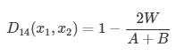

Where:

- W is the sum of the lowest abundances in each species found between sites x1 and x2
- A is the sum of all abundances in x1
- B is the sum of all abundances in x2

Using the same data set above, we can calculate the Bray-Curtis coefficient using the vegdist() function in the vegan package:

``` {r}
(Y.hmm.BCdist <- vegan::vegdist(Y.hmm, method = "bray", binary = FALSE))

(Y.hmm.BCdist.matrix <- as.matrix(Y.hmm.BCdist))

```

Again, lower numbers indicate higher similarities. In contrast to the Euclidean coefficient, the Bray-Curtis coefficient between site 1 and site 3 indicates that these sites are less similar compared to their relationship with site 2. Therefore, the Bray-Curtis coefficient is better at capturing site differences with species abundances which helps deal with the **double-zero problem**. 

Below is a function to calculate the Bray-Curtis distance by hand:
``` {r}
# Calculate Bray-Curtis coefficient by hand
calc_bc_dist <- function(spe_abun_df) {
  # Create output matrix
  output <- as.data.frame(matrix(NA, nrow = nrow(spe_abun_df), ncol =
                                   nrow(spe_abun_df)), 
                          row.names = rownames(spe_abun_df))
  colnames(output) <- rownames(spe_abun_df)
  # Index through the rows of the data frame
  for (i in 1:nrow(spe_abun_df)) {
    x1 <- spe_abun_df[i, ]
    for (t in 1:nrow(spe_abun_df)) {
      x2 <- spe_abun_df[t,]
      # Create empty data frame to find the minimum values of each species between two sites
      comp_df <- as.data.frame(matrix(nrow = 2, ncol = ncol(spe_abun_df)))
      # Place the site values into the data frame
      comp_df[1,] = x1
      comp_df[2,] = x2
      # Find the minimum abundance values of each species and sum them.
      min_abundances <- apply(comp_df, 2, min)
      W <- sum(min_abundances)
      # Sum the abundances of site 1
      A = sum(x1)
      # Sum the abundances of site 2
      B = sum(x2)
      # Calculate the Bray-Curtis coefficient
      bc_dist <- (1 - ((2 * W) / (A + B)))
      # Place the BC coefficient into the output data frame
      output[i,t] <- bc_dist
    }
  }
  # Return output
  return(output)
}

# Run Bray-Curtis coefficient by hand function
calc_bc_dist(Y.hmm)

```

#### Other Distance Coefficients

Besides Euclidean distance, common **Metric** coefficients include **Chord distances** and **Jaccard’s coefficient**. Another common **Semimetric coefficient** is **Sørensen’s coefficient**. A final group of distance coefficients are **Nonmetric**, one of which is **Mahalanobis distance**. You can find out more about these distance coefficients [here](https://r.qcbs.ca/workshop09/book-en/types-of-distance-coefficients.html#bray-curtis-coefficient)

## Unconstrained Ordination

Unconstrained ordination methods are multivariate techniques used to visualize and explore relationships among variables or observations in a dataset without imposing any specific constraints on the relationships. 

These methods are called “unconstrained” because they do not require prior knowledge or assumptions about the structure of the data or the relationships among variables.

Unconstrained ordination methods work by representing the variables or observations in a lower-dimensional space, such as a two-dimensional or three-dimensional plot, while preserving the overall structure of the data.

Some common unconstrained ordination methods include **principal component analysis (PCA)**, **correspondence analysis (CA)**, and **multidimensional scaling (MDS)**. These methods can be applied to a wide range of ecological data, including species abundance data, environmental data, and community similarity matrices.

Overall, unconstrained ordination methods are widely used in ecology to explore patterns and relationships among biological communities and environmental variables. These methods are valuable tools for identifying key factors that influence community composition and structure, and for developing hypotheses about the underlying ecological processes that drive these patterns.


### Principal Component Analysis

Principal Component Analysis (PCA) is a statistical technique used to reduce the dimensionality of a dataset while retaining most of its variability. It's more common uses are analyzing environmental gradients.

It is a linear transformation method that converts the original set of variables into a new set of linearly uncorrelated variables, called principal components (PCs), which are sorted in decreasing order of variance.

PCA has become one of the most commonly used techniques in data analysis due to its ability to identify hidden patterns and reduce the complexity of high-dimensional data.

In essence, PCA aims to find the linear combinations of the original variables that account for the largest possible amount of variation in the dataset. The resulting principal components are orthogonal to each other, meaning that they are not correlated, and their order reflects their importance in explaining the variability of the data.

To become comfortable with PCA, we will follow with detailed examples on how to perform it step-by-step, and then we will use functions from R packages to do it.

1. Load the data set
``` {r}
data(Doubs)
data <- Doubs.env[,3:8] # Only going to use 6 variables from the data-set
```
2. Standardize the data to have a mean of zero and unit variance:
``` {r}
data_std <- as.data.frame(scale(data))
head(data_std)
```
3. Compute the Covariance Matrix
```{r}
cov_matrix <- cov(data_std)
head(cov_matrix)
```

4. Perform the Eigen-decomposition of the covariance matrix

Eigendecomposition is a fancy way of saying calculating the eigenvectors and eigenvalues of a matrix. The eigenvectors represent the directions in covariance space that capture the maximum amount of variance in the data, and the eigenvalues indicate the amount of variance captured by each eigenvector.

Visually, you think of an eigenvector below:

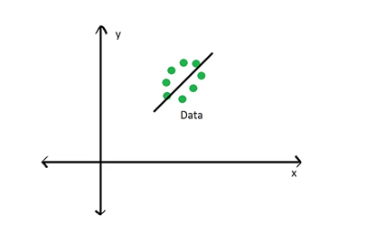

Where the black line running through the data represents an eigenvector which captures the most amount of variance of the data. For a PCA, this eigenvector represents the **first principal component**. The **second principal component** would be orthogonal to this eigenvector, as seen below: 

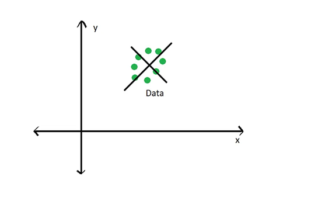

Calculating eigenvectors and eigenvalues involves several involved linear algebra and matrix multiplication steps, which we won’t go into detail here. For this lecture, it’s important to understand what eigenvectors and eigenvalues are and how they relate to our data. If you want to understand those steps, a brief introduction can be found [here](https://lpsa.swarthmore.edu/MtrxVibe/EigMat/MatrixEigen.html) and a good youtube tutorial can be found [here](https://www.youtube.com/watch?v=IdsV0RaC9jM).

You can easily compute the eigenvalues and eigenvectors using the eigen() function:
```{r}
eigen_decomp <- eigen(cov_matrix)

# Extract Eigenvalues
(eig_values <- eigen_decomp$values)

```

Again, eigenvalues tell us the relative amount of variance explained by each eigenvector. The higher the eigenvalue, more more variance explained by that eigenvector.

``` {r}
# Extract Eigenvectors
eig_vectors <- eigen_decomp$vectors
rownames(eig_vectors) = colnames(data_std)
colnames(eig_vectors) = c("EV1", "EV2", "EV3", "EV4", "EV5", "EV6")

# Extract the first two eigenvectors
eig_vec_1 <- eig_vectors[,1]
eig_vec_2 <- eig_vectors[,2]
```

5. Show amount of variance contributed by each Principal Component by making a Scree Plot.

``` {r}
  # Calculate the estimated variance for each eigenvalue
(e_var <- eig_values / (nrow(data_std) - 1))

  # Data frame with variance percentages
var_per <- data.frame(
  PC  = c("PC01", "PC02", "PC03", "PC04", "PC05", "PC06"),
  PER = c(e_var) * 100 / sum(e_var) # Calculate the percentage
)
  # Scree plot to show amount of variance accounted by each principal component
barplot(PER ~ PC, data = var_per,
        xlab = "Principal Components",
        ylab = "Percent of Variation %")
```

6. Selecting Principal Components 

It is generally a good idea to select the principal components that explain most of the variance in the data. The most common method is the **Kaiser-Guttman Criterion** , which states that any eigenvector with an eigenvalue greater than 1 should be retained.
  
``` {r}
eig_val_PC <- data.frame(
  PC = c("PC01", "PC02", "PC03", "PC04", "PC05", "PC06"),
  EV = eig_values
)

barplot(EV ~ PC, data = eig_val_PC,
        xlab = "Principal Components",
        ylab = "Eigenvalues"
        )
abline(h = 1, col = "red")
```

Another common method for choosing principal components is the **Broken stick Model**. It provides "a good combination of simplicity of calculation and accurate evaluation of dimensionality relative to the other statistical approaches" (Jackson 1993). The methods works by keeping "[principal] components that explain more variance than would be expected by randomly dividing the variance into p parts.The "expected proportions" would correspond to a null model that contains uncorrelated (noise) variables. If you plot the eigenvalues of the correlation matrix against the broken-stick proportions, the observed proportions that are higher than the expected proportions indicate which principal components to keep. Fall on conservative side of Principal Component selections.

``` {r}
broken_stick <- function(eig_values) {
  # Calculate Broken Stick Model
  n = length(eig_values)
  bsm = data.frame(j=seq(1:n), prop_var=0)
  bsm$prop_var[1] = 1/n
  for (i in 2:n) {
    bsm$prop_var[i] = bsm$prop_var[i-1] + (1/(n + 1 - i))
    }
  bsm$prop_var = 100*bsm$prop_var/n
  
  # Plot Broken Stick Modol Over 
  barplot(t(cbind(100*eig_values/sum(eig_values), bsm$p[n:1])),
        beside=TRUE, 
        main="Broken Stick Model",
        col=c("red","blue"),
        las=2,
        xlab = "Principal Components", ylab = "Percent of Variation (%)")
  legend("topright", c("Eigenvalues", "Broken stick model"), 
         pch=15,
         col=c("red","blue"), 
         bty="n")

}

broken_stick(eig_values)
```

# 7. Plot the Principal Components over the data

``` {r}
  # Plot only the first two Principal Components
plot(har ~ pH, col = as.factor(rownames(data_std)), pch = 19, xlim=c(-4, 4), ylim = c(-4,4), data = (data_std), xlab = "pH (Standardized)", ylab = "har (Standardized)")
abline(v=0 , h=0, col = "dark gray")

  # Overlap pertinent eigenvector
abline(0, eig_vec_1[2]/eig_vec_1[1], col='purple')

  # Plot the lines from first eigenvector to points
line1 <- c(0, eig_vec_1[2]/eig_vec_1[1])
perp.segment.coord <- function(x0, y0, line1){
  a <- line1[1]  #intercept 
  b <- line1[2]  #slope
  x1 <- (x0 + b * y0 - a * b)/(1 + b^2)
  y1 <- a + b * x1
  list(x0 = x0, y0 = y0, 
       x1 = x1, y1 = y1)
}
ss <- perp.segment.coord(data_std[,1], data_std[,2], line1)
segments(x0 = ss$x0, x1 = ss$x1, y0 = ss$y0, y1 = ss$y1, col = 'purple')
with(data_std, text(har ~ pH, labels = as.factor(rownames(data_std)), pos = 1, cex=1))
title(main = "First Principal Component over the Standardized Data",
      sub = "Purple Lines Horizontal to the First Principal Components is the Variance", cex.sub = 0.75)

  # Plot both the first and second principal component

  # Make another plot to show second principle component
plot(har ~ pH, col = as.factor(rownames(data_std)), pch = 19, xlim=c(-4, 4), ylim = c(-4,4), data = (data_std), xlab = "pH (Standardized)", ylab = "har (Standardized)")
abline(v=0 , h=0, col = "dark gray")

  #Overlap pertinent eigen-vectors
abline(0, eig_vec_1[2]/eig_vec_1[1], col='purple')
abline(0, eig_vec_2[2]/eig_vec_2[1], col='orange')

# Plot the lines from first eigenvector and second to points
line2 <- c(0, eig_vec_2[2]/eig_vec_2[1])
ss <- perp.segment.coord(data_std[,1], data_std[,2], line2)
segments(x0 = ss$x0, x1 = ss$x1, y0 = ss$y0, y1 = ss$y1,col = 'orange')
with(data_std, text(har ~ pH, labels = as.factor(rownames(data_std)),pos = 1, cex=1))
title(main = "First (Purple) and Second (Orange) Principal Component over the Standardized Data", cex.main = 0.8, sub = "Lines Horizontal to the Principal Components are the Variance", cex.sub = 0.75)
```


8. Loading Scores

Elements of each eigenvector are called loadings and can be interpreted as the contribution of each variable in the data set to the corresponding principal component.

You can make a table with these values and see the contributions of each variable to each principal component:

``` {r}  
  # Get variable loading scores
variable.loads <- data.frame(
  PC01 = eig_vec_1, # First eigenvector
  PC02 = eig_vec_2  # Second eigenvector
)

# You can also calculate the loading score for each site, which shows how they are placed in relation to the principal components.

  # Calculate site loading scores
loading.scores <- as.data.frame(as.matrix(data_std) %*% eig_vectors)
colnames(loading.scores) = c("PC01", "PC02", "PC03", "PC04", "PC05", "PC06")
```

9. Make a biplot of the Principal Componants and Variable Loading Scores

``` {r}
  # Set plot parameters
par(mar = c(5, 5, 10, 5), mgp = c(2, 1, 0))

  # Plot site loading scores
plot(loading.scores[,2] ~ loading.scores[,1],
     xlab = 'PC1', ylab = "PC2", xlim = c(-8,8),ylim = c(-8,8),col = as.factor(rownames(loading.scores)), pch = 19)
abline(v = 0, col = "orange")
abline(h = 0, col = "purple")
with(loading.scores, text(PC02 ~ PC01, labels = as.factor(rownames(loading.scores)),pos = 1, cex=1))

par(new=TRUE)

  # Overlay the variable loading scores
plot(PC02 ~ PC01,
     xlim = c(-0.8, 1), ylim = c(-0.8,1),  col = "red", pch = 8, axes = F, xlab = "", ylab = "", data = variable.loads)
axis(4, ylim = c(-1,1), col = "red")
axis(3, xlim = c(-0.9,1), col = "red")
mtext("Loading Scores",side=3,col="red",line=2.5)  
mtext("Loading Scores",side=4,col="red",line=2.5)  
for (i in 1:nrow(variable.loads)) {
  arrows(x0 = 0, y0 = 0, x1 = variable.loads[i,1],y1 = variable.loads[i,2],
         col = "red", lwd = 1, length = 0.1)
}
with(variable.loads, text(PC02 ~ PC01, labels = as.factor(rownames(variable.loads)),pos = 1, cex=1,
                 col = "red"))

title(main = "Biplot of Site and Variable Loading Scores against the First and Second Principal Components", cex.main = 0.75)
```

PCA analysis using built-in functions

``` {r}
  # Using stats::prcomp()
PCA_prcomp <- stats::prcomp(data_std, center = TRUE, scale = T)
biplot(PCA_prcomp, scale = 0, xlim = c(-8, 8), ylim = c(-8, 8))
abline(v = 0, h = 0)

  # Using stats: princomp()
PCA_princomp <- stats::princomp(data_std)
biplot(PCA_princomp)
abline(v= 0, h = 0)

  # Using the vegan::rda() function
PCA_rda <- vegan::rda(data_std)
biplot(PCA_rda)
```

We can analyze these plots by remembering that our Principal components are linear combinations through our environmental variables. The first principal component(PC1) is most correlated with our phosphorus, ammonia, and oxygen variables, as they are all long the same axis. As we move negatively along PC1, we increase in ammonia and phosphorus, while simultaneously decreasing in oxygen. 